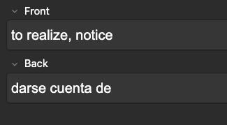
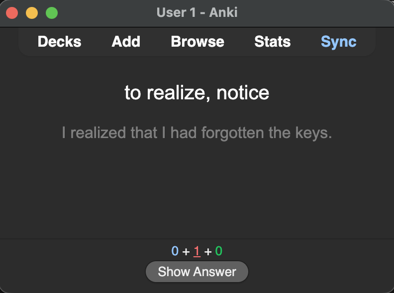
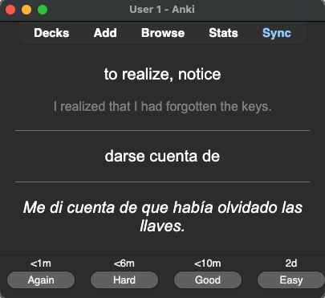

# Anki AI Language Vocab Helper

An Anki add-on for language vocabulary flashcards. It asks the learner to translate an example sentence (context hint) for each card during review. This helps connect a word with how it's used. The example sentences are created on-the-fly and shown on the card during review, but the card itself is not edited. It uses `gemini-2.0-flash` which turned out to be a good balance between quality and latency. The source and target language can be adjusted in the config file.

The add-on requires flashcards in a specific format:

*   **Front:** Word or expression in your source language (e.g. English if you're learning a new language as an English speaker)
*   **Back:** Translation in target language (the language you are trying to learn)

## Example
In this example, the source language is English and the target language is Spanish. The front side asks us to translate the expression "to realize, notice" into Spanish. The solution on the back side is "darse cuenta de".

When reviewing the card, an example sentence using the expression in a meaningful context is generated and presented to us below the actual expression. In this example, the generated context hint is "I realized that I had forgotten the keys"

The back side then shows the solution along with the translation of the context hint, in this case "Me di cuenta de que había olvidado las llaves".

This allows us to practice the expression in a natural way. The example sentence for each card is cached during the session - when we review the same card again, the same sentence will be shown. The cache is cleared upon quitting Anki. The cards are never actually edited on disk.

## Planned Features

*   **Persistent Storage:** Ability to save context hints to storage to reuse sentences across sessions and reduce LLM requests (with an opt-out for fresh generation). However, it is intentionally not planned to edit the cards themselves, so that the add-on's data stays segregated, backwards-compatible, and idempotent.
*   **Review UI:**
    *   Button to save the current sentence to storage.
    *   Button to generate a new sentence on demand.

## Setup

1.  Save the whole directory into your **Anki add-on folder**
2.  Replace the contents of the "api_key" file with your Google API key. You can create a free tier API key at https://aistudio.google.com/
3.  Set the source and target language in the "config.json" file. For example, if you're an English speaker and want to learn peninsular Spanish, you need to set "source_language" to "English" and "target_language" to "Spanish (peninsular)"
4.  **Restart** Anki.
